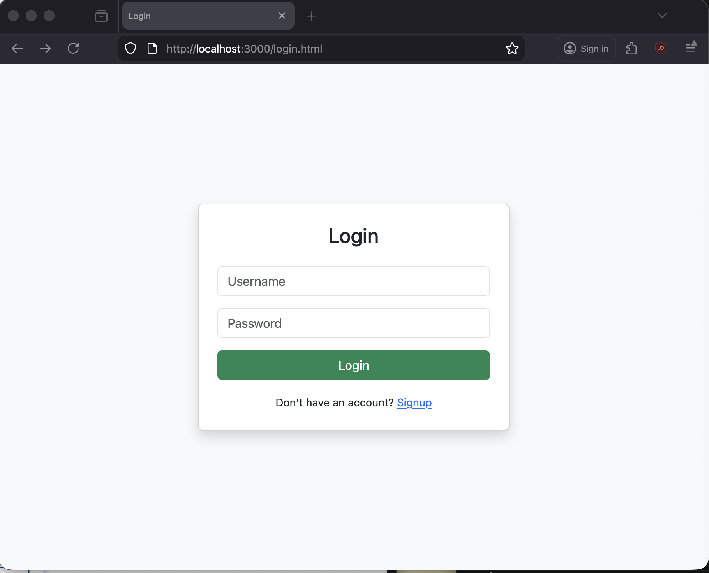

# Real-Time Chat Application
COMP 3133 – Lab Test 1

This project is a real-time chat application built using:

- Node.js
- Express
- Socket.io
- MongoDB
- Mongoose
- HTML5
- Bootstrap
- fetch API

The application allows users to:
- Sign up
- Log in
- Join predefined chat rooms
- Send and receive real-time messages
- See typing indicators
- Log out
- Store messages in MongoDB

---

---

## Backend Explanation (server.js)

### 1 Express Server Setup  

- Express is used to handle HTTP requests.

### 2 MongoDB Connection
- The application connects to MongoDB locally.

- DATABASE SCHEMA
- Stores registered user information: userbname, first name and last name

- GROUP MESSAGE SCHEMA
- Store room based chat messages

- SIGN UP
- username and must be unique and data is stored in mongoDB.

- LOGIN
- on successful login, user credentials are saved in local storage and redirects to room selection

- TYPING INDICATOR
- when the user types, the other user sees the usrname is typing....

- LOGOUT 
- logging out clears session and disconnects the user.